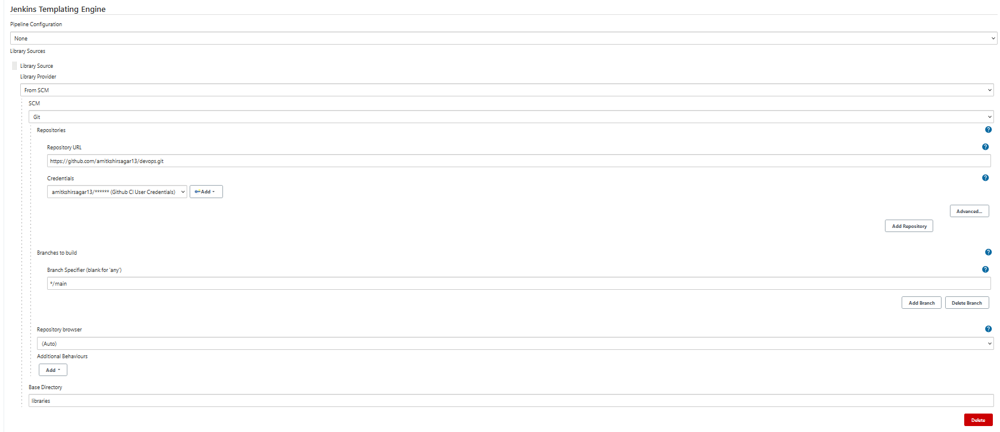
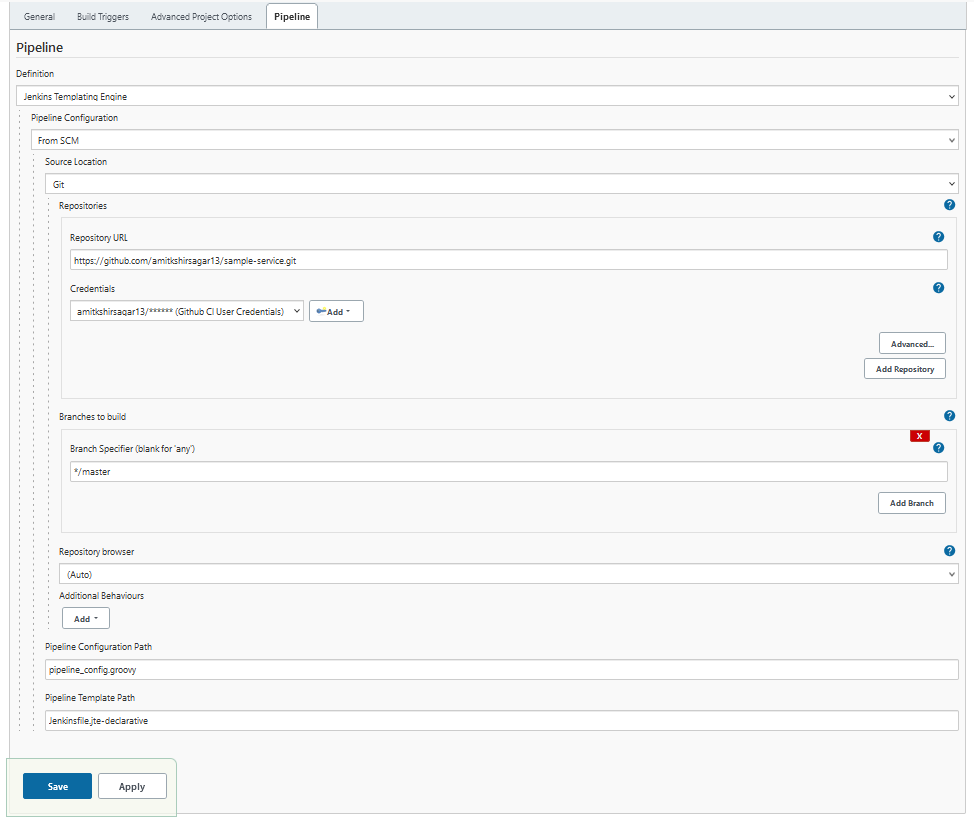

# Nice refence:

Below link is to youtube video, nice demo and explaination for JTE [Nice JTE Demo](https://www.youtube.com/watch?v=FYLaoqn0pDE)

## Jenkins Setup
- Use Jcasc
- Add plugings during startup
- Use `jcasc.yaml` to define setup
- Add secrets to `secrets` folder in correct directory structure in plain text files. (Need to move to read from Vault for future)
- Use separate `*-plugins.txt` to enable setup of plugins in layer

## Plugins:
 - [kubernetes-cli:1.10.3](https://plugins.jenkins.io/kubernetes-cli/)
  
    - Generate Credentials:
  
      ```
        # Create a ServiceAccount named `jenkins-robot` in a given namespace.
        $ kubectl -n <namespace> create serviceaccount jenkins-robot

        # The next line gives `jenkins-robot` administator permissions for this namespace.
        # * You can make it an admin over all namespaces by creating a `ClusterRoleBinding` instead of a `RoleBinding`.
        # * You can also give it different permissions by binding it to a different `(Cluster)Role`.
        $ kubectl -n <namespace> create rolebinding jenkins-robot-binding --clusterrole=cluster-admin --serviceaccount=<namespace>:jenkins-robot

        # Get the name of the token that was automatically generated for the ServiceAccount `jenkins-robot`.
        $ kubectl -n <namespace> get serviceaccount jenkins-robot -o go-template --template='{{range .secrets}}{{.name}}{{"\n"}}{{end}}'
        jenkins-robot-token-d6d8z

        # Retrieve the token and decode it using base64.
        $ kubectl -n <namespace> get secrets jenkins-robot-token-d6d8z -o go-template --template '{{index .data "token"}}' | base64 -d
        eyJhbGciOiJSUzI1NiIsImtpZCI6IiJ9.eyJpc3MiOiJrdWJlcm5ldGVzL3NlcnZpY2V[...]
      ```
    - Usage example:
      ```
        node {
          stage('List pods') {
            withKubeConfig([credentialsId: '<credential-id>',
                            caCertificate: '<ca-certificate>',
                            serverUrl: '<api-server-address>',
                            contextName: '<context-name>',
                            clusterName: '<cluster-name>',
                            namespace: '<namespace>'
                            ]) {
              sh 'kubectl get pods'
            }
          }
        }
      ```


 - jte

### JTE template setup
- Plugin: `templating-engine:latest`
  
  ```
  templateGlobalConfig:
    tier:
      configurationProvider: "null"
      librarySources:
      - libraryProvider:
          scm:
            baseDir: "libraries"
            scm:
              git:
                branches:
                - name: "*/main"
                buildChooser: "default"
                userRemoteConfigs:
                - credentialsId: "github-ci-user"
                  url: "https://github.com/amitkshirsagar13/devops.git"
  ```
  


### JTE Pipeline Sample-Service

#### sample-service with Scripted Pipeline
  

#### sample-service with Declarative Pipeline
  


