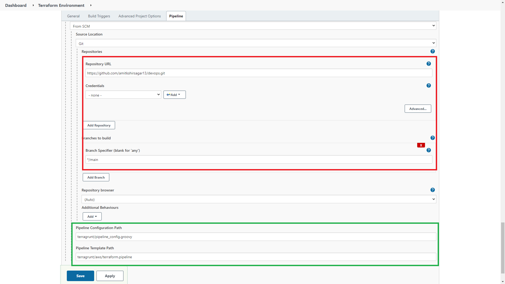

### Run terragrunt commands

- Create Terraform backup repository to store state

```
aws --endpoint-url=http://localstack.localtest.me:4566 s3 mb s3://k8clusters-terraform-state-local
aws --endpoint-url=http://localhost:4566 dynamodb create-table --table-name local-terraform-lock-table \
    --attribute-definitions AttributeName=LockID,AttributeType=S --key-schema AttributeName=LockID,KeyType=HASH \
    --provisioned-throughput ReadCapacityUnits=5,WriteCapacityUnits=5
```

- Configure terraform-live as below



### Tutorial for lookup

- [Terraform Pipelines in Jenkins
  ](https://medium.com/@timhberry/terraform-pipelines-in-jenkins-47267129ff06)

```
terragrunt init
```

```
terragrunt plan
```

```
terragrunt plan -var application=k8cluster
```

```
terragrunt apply
```

```
terragrunt apply -var application=demo
```
